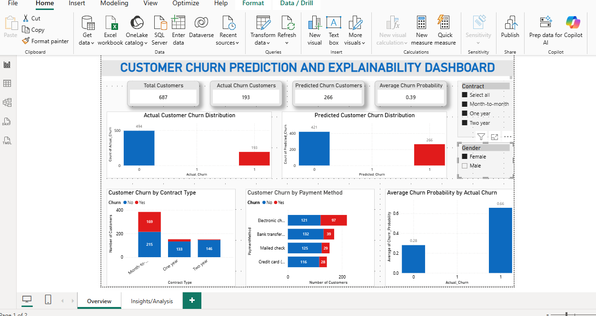
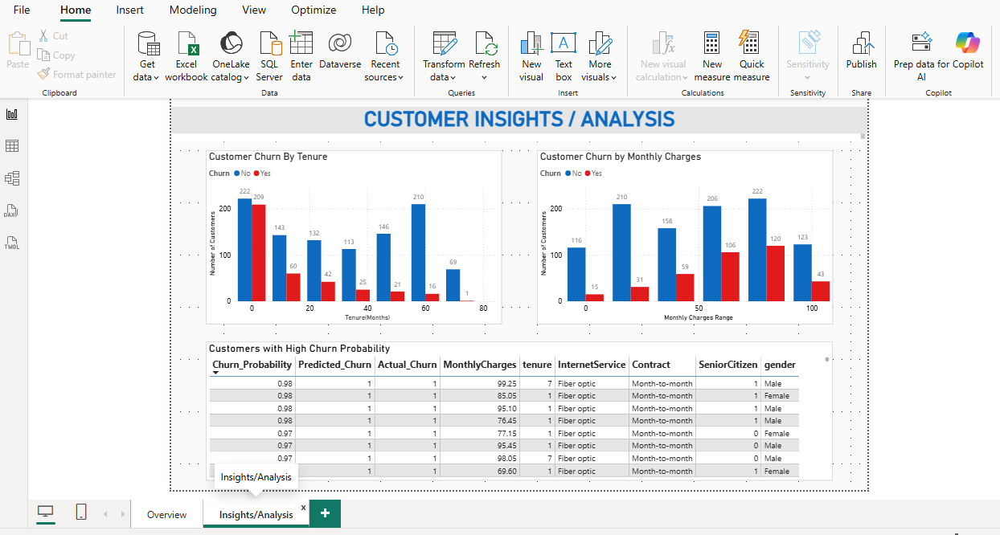

# Customer Churn Prediction using Machine Learning and Explainable AI (SHAP)

## Overview

This project focuses on predicting customer churn using machine learning techniques and improving model interpretability using SHAP (SHapley Additive Explanations).
The project combines predictive analytics, explainable AI, and business intelligence dashboarding to identify high-risk customers and support customer retention strategies.

## Features

- Data preprocessing and cleaning
- Exploratory Data Analysis (EDA)
- Machine learning model development
- Logistic Regression, Random Forest, and XGBoost implementation
- Model evaluation using Accuracy, Precision, Recall, F1-score, and ROC-AUC
- Explainable AI using SHAP
- Interactive Power BI dashboard

## Technologies Used

- Python
- Pandas
- NumPy
- Scikit-learn
- XGBoost
- SHAP
- Matplotlib
- Seaborn
- Power BI

## Results

- XGBoost achieved the best predictive performance
- SHAP identified contract type, tenure, and monthly charges as major churn drivers
- Power BI dashboard visualised customer insights and prediction outputs

## Dashboard Preview

